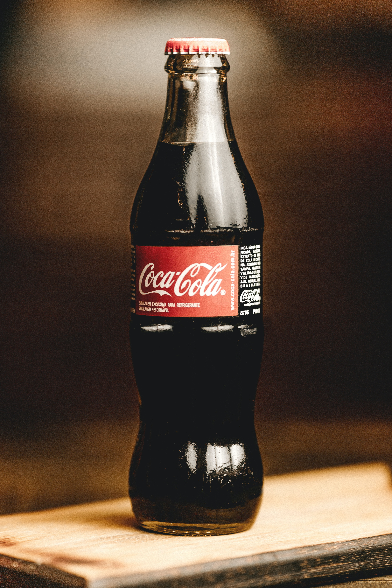
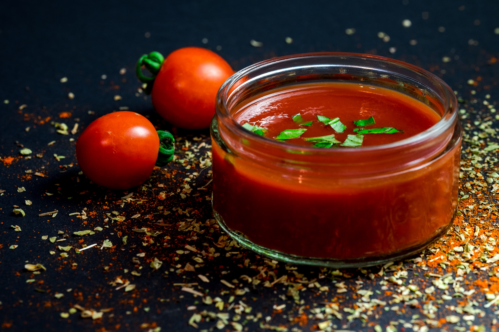

# Menu

## Pizza

| Lp. | Nazwa | Mała | Średnia | Duża |
|-----|-------|------|---------|------|
| 1. | Margarita | 23 zł | 28 zł | 42 zł|
| 2. | Fungini | 25 zł | 30,50 zł | 44 zł|
| 3. | Capricciosa | 28 zł | 32 zł | 46 zł|
| 4. | Salami | 27 zł | 31,50 zł | 44,50 zł|
| 5. | Hawaii | 28 zł | 32 zł | 46 zł|
| 6. | Tonno | 29 zł | 33 zł | 47 zł|
| 7. | Diabolo | 31,50 zł | 36,50 zł | 49 zł|
| 8. | Wegetariana | 30 zł | 34 zł | 47 zł|
| 9. | Vinci | 32 zł | 36 zł | 47 zł|
| 10. | Chicken | 32 zł | 36 zł | 49 zł|

## Dodatki do pizzy

| Lp. | Nazwa | Mała | Średnia | Duża |
|-----|-------|------|---------|------|
| 1. | ser, szynka ,tuńczyk | 6 zł | 7 zł | 9 zł|
| 2. | pomidor, szparagi, ogorki  | 5 zł | 6 zł | 8 zł|
| 3. | papryka, czosnek,oliwki,kukurydza,peperoni | 4 zł | 6 zł | 7 zł|
| 4. | frytki | 4 zł | 6 zł | 10 zł|

## Napoje

| Lp. | Nazwa | Puszka 330ml | Butelka 0.5l | Butelka 1l |
|-----|-------|--------------|--------------|------------|
| 1. | Pepsi | 7 zł | 8 zł | 10 zł|
| 2. | Coca-Cola | 6 zł | 8 zł | 9 zł|
| 3. | Lipton Green | 6 zł | 8 zł | 9 zł|
| 4. | Sok jabłkowy | 5 zł | 8 zł | 10 zł|
| 5. | Sok pomarańczowy | 4 zł | 6 zł | 8zł|
| 6. | Woda gazowana | 3 zł | 5 zł | 7 zł|
| 7. | Woda niegazowana | 2 zł | 4 zł | 6 zł|

## Sosy

| Lp. | Nazwa | Cena za dodatkowe opakowanie  | 
|-----|-------|-------------------------------|
| 1. | pomidorowy | 2 zł |
| 2. | curry | 4 zł |
| 3. | diabelski pomidorowy | 6 zł |
| 4. | koktajlowy | 3 zł |
| 5. | meksykański | 5 zł |
| 6. | serowy | 8 zł |
| 7. | belgijski | 4 zł |

